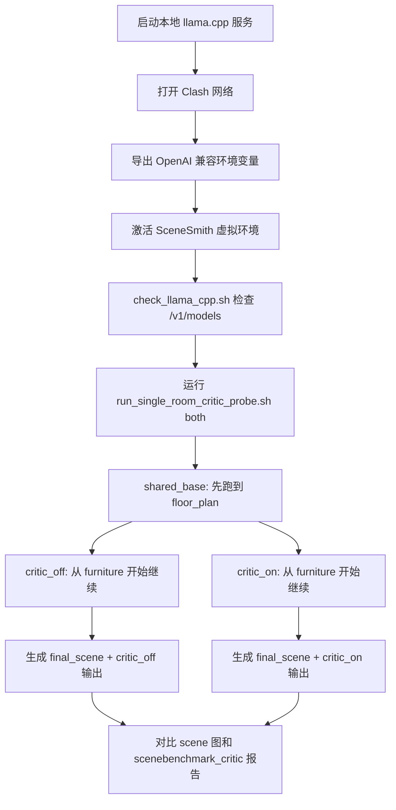

# Critic Probe 测试说明

这份文档总结下面这组命令实际做了什么，以及它验证的是哪一层能力。

适用对象：

- 想复现本地 `llama.cpp + Qwen3.6-27B` 推理环境的人
- 想理解 `run_single_room_critic_probe.sh both` 这次到底测了什么的人
- 想快速找到输出目录和对比重点的人

## 1. 这次测试的目标

这不是一个“完整室内场景质量基准测试”，而是一个更聚焦的 `critic probe`：

1. 用固定的一组单房间 prompt 刻意制造更容易触发 `spatial_accessibility` 和 `functional_dependency` 的拥挤场景
2. 在相同 floor plan 基础上，分别跑 `critic_off` 和 `critic_on`
3. 对比开启 SceneBenchmark critic 后，场景是否更容易出现可解释的改进

这次命令的核心目标是验证：

- `SceneBenchmark critic` 能否真正影响家具 / manipuland 阶段的设计结果
- 这种影响能否在最终 `final_scene` 和 `scenebenchmark_critic.md/json` 里被看出来

## 2. 整体流程图



## 3. 第一步：启动本地 llama.cpp 服务

命令：

```bash
cd /data/task3_2/L202500266_hrk/code
mkdir -p /data/task3_2/L202500266_hrk/code/llama_slot_cache

nohup env \
  HOST=0.0.0.0 \
  PORT=8002 \
  CTX_SIZE=262144 \
  PARALLEL=1 \
  CACHE_TYPE_K=q8_0 \
  CACHE_TYPE_V=q8_0 \
  VISION=true \
  THREADS=96 \
  THREADS_HTTP=32 \
  BATCH_SIZE=2048 \
  UBATCH_SIZE=512 \
  MODEL_DIR=/data/task3_2/share_model/unsloth/Qwen3.6-27B-GGUF \
  MODEL=/data/task3_2/share_model/unsloth/Qwen3.6-27B-GGUF/Qwen3.6-27B-Q8_0.gguf \
  MMPROJ=/data/task3_2/share_model/unsloth/Qwen3.6-27B-GGUF/mmproj-F16.gguf \
  ./run_qwen36_27b_llama_cpp.sh \
  --cache-prompt \
  --cache-ram 16384 \
  --cache-idle-slots \
  --ctx-checkpoints 64 \
  --cache-reuse 256 \
  --slot-prompt-similarity 0.5 \
  > /data/task3_2/L202500266_hrk/code/llama_qwen36_27b_q8_cache.log 2>&1 &
```

这一步做了三件事：

1. 启动一个本地 OpenAI-compatible API 服务，监听 `http://127.0.0.1:8002/v1`
2. 使用 `Qwen3.6-27B-Q8_0.gguf` 作为文本模型，`mmproj-F16.gguf` 作为视觉投影模型
3. 打开 prompt cache / slot cache，尽量减少多轮 probe 中重复前缀的重算成本

这组配置的重点是：

- `CTX_SIZE=262144`
  让 critic / planner / designer 在长上下文下更稳定
- `VISION=true`
  允许模型消费渲染图
- `PARALLEL=1`
  明确串行跑，避免多路请求时上下文缓存和显存更复杂
- `--cache-prompt`、`--cache-idle-slots`、`--cache-reuse 256`
  尽量复用 shared prompt 前缀，适合 `shared_base -> critic_off -> critic_on` 这种重复结构

相关日志文件：

- [llama_qwen36_27b_q8_cache.log](../../llama_qwen36_27b_q8_cache.log)

## 4. 第二步：打开网络代理

命令：

```bash
clashctl on
```

这一步主要是为可能的外部依赖留通路，例如：

- Hugging Face 相关缓存访问
- 目标分支如果启用了远程模型或远程资源

严格说，这不是 `critic probe` 本身的逻辑核心，但这是这次运行环境的一部分。

## 5. 第三步：导出 OpenAI 兼容环境变量

命令：

```bash
export OPENAI_API_KEY=sk-123
export OPENAI_BASE_URL=http://127.0.0.1:8002/v1
export OPENAI_USE_RESPONSES=false
export HF_HOME=/data/task3_2/L202500266_hrk/.cache/huggingface
export MODEL_NAME=Qwen3.6-27B-Q8_0
```

这一步的作用是把 SceneSmith 的 OpenAI 调用重定向到本地 `llama.cpp` 服务：

- `OPENAI_BASE_URL=http://127.0.0.1:8002/v1`
  指向本地推理服务
- `OPENAI_API_KEY=sk-123`
  本地兼容服务通常只要有一个非空 key
- `OPENAI_USE_RESPONSES=false`
  明确走当前项目兼容的 chat/completions 风格，而不是 Responses API
- `HF_HOME=...`
  把 huggingface 缓存放到固定目录
- `MODEL_NAME=Qwen3.6-27B-Q8_0`
  让 SceneSmith 各 agent 配置统一引用这个模型名

## 6. 第四步：进入 SceneSmith 环境并检查服务

命令：

```bash
cd /data/task3_2/L202500266_hrk/code/scenesmith
source .venv/bin/activate

bash /data/task3_2/L202500266_hrk/code/check_llama_cpp.sh
```

虚拟环境：

- [scenesmith/.venv](../.venv)

服务检查脚本：

- [check_llama_cpp.sh](../../check_llama_cpp.sh)

这个脚本本身很简单，它会反复轮询：

- `http://127.0.0.1:8002/v1/models`

直到本地模型服务返回成功再继续。  
也就是说，这一步的目的不是跑测试，而是保证后面的批跑不是在模型还没 ready 时直接失败。

## 7. 第五步：执行 critic probe

命令：

```bash
SCENE_BATCH_SIZE=1 \
MODEL_NAME=Qwen3.6-27B-Q8_0 \
OPENAI_BASE_URL=http://127.0.0.1:8002/v1 \
OPENAI_API_KEY=sk-123 \
OPENAI_USE_RESPONSES=false \
HF_HOME=/data/task3_2/L202500266_hrk/.cache/huggingface \
BRANCH_FROM_SHARED_BASE=true \
SHARED_BASE_STOP_STAGE=floor_plan \
PIPELINE_STOP_STAGE=manipuland \
SKIP_WALL_MOUNTED=true \
SKIP_CEILING_MOUNTED=true \
bash /data/task3_2/L202500266_hrk/code/scenesmith/scripts/run_single_room_critic_probe.sh both
```

批跑脚本：

- [scripts/run_single_room_critic_probe.sh](../scripts/run_single_room_critic_probe.sh)

### 7.1 `both` 做了什么

`both` 模式表示：

1. 先跑 `critic_off`
2. 再跑 `critic_on`

脚本内部的模式说明就在：

- [scripts/run_single_room_critic_probe.sh](../scripts/run_single_room_critic_probe.sh)

### 7.2 `SCENE_BATCH_SIZE=1` 做了什么

这次设置成 `1`，意味着：

- 每个 case 单独形成一个 `batch_XXX`
- 每个批次只有一个 scene

好处是：

- 目录更容易看
- `scene_001` 和 `batch_001` 基本一一对应
- 更方便做 `critic_off` / `critic_on` 成对对比

### 7.3 `BRANCH_FROM_SHARED_BASE=true` 做了什么

这是这次测试最关键的设置之一。

它会先跑一遍：

- `shared_base`

然后让：

- `critic_off`
- `critic_on`

都从同一个 shared base 继续往后生成，而不是各自从头随机开始。

这一步的目的，是减少对比中的“前缀随机性”。

也就是说，这次测试不是在比较两次完全独立生成，而是在尽量保证相同 floor plan 起点的前提下，比较 `critic` 开关对后续阶段的影响。

### 7.4 `SHARED_BASE_STOP_STAGE=floor_plan` 做了什么

`shared_base` 只跑到：

- `floor_plan`

然后从下一阶段开始分叉。

配合脚本里的逻辑，这意味着：

- `shared_base` 负责统一房间布局基础
- `critic_off` 和 `critic_on` 从 `furniture` 开始各自继续

这正好适合验证 critic 是否影响：

- 家具摆放
- manipuland 摆放
- 最终 `final_scene`

### 7.5 `PIPELINE_STOP_STAGE=manipuland` 做了什么

这会让 pipeline 一直跑到：

- `manipuland`

在当前脚本里，这个值最终对应关注的 report stage 是：

- `final_scene`

也就是说，这次对比不是只看 `scene_after_furniture`，而是看包含 manipuland 的最终场景。

### 7.6 `SKIP_WALL_MOUNTED=true` 和 `SKIP_CEILING_MOUNTED=true` 做了什么

这两个设置会跳过：

- wall-mounted 阶段
- ceiling-mounted 阶段

目的很明确：

- 把变量尽量收敛到 furniture + manipuland
- 降低 wall / ceiling 物体对 accessibility 和 functional dependency 的干扰
- 缩短测试时间

因此，这次 probe 更接近：

- 单房间 floor plan 固定
- 只测试平面家具布局和桌面/床面等 manipuland 支撑关系

## 8. 这次实际跑了哪些 case

脚本内置了 5 个更容易刺激 critic 的场景：

1. `tiny_bedroom_wardrobe`
   重点是床侧通行和衣柜可达性
2. `small_dining_six_chairs`
   重点是餐桌-餐椅关系和餐区可达性
3. `narrow_home_office`
   重点是书桌接近路径、办公椅与书桌关系
4. `packed_bedroom_desk_block`
   重点是床侧可达性和卧室多功能拥挤
5. `compact_studio_two_zones`
   重点是混合功能分区和基本通行空间

这些 case 定义在：

- [scripts/run_single_room_critic_probe.sh](../scripts/run_single_room_critic_probe.sh)

## 9. 输出目录里会有什么

这次批跑的输出根目录形式是：

- [outputs/critic_probe/](../outputs/critic_probe/)

本次已经存在的对照运行包括：

- [outputs/critic_probe/2026-06-26_12-59-56/](../outputs/critic_probe/2026-06-26_12-59-56/)

这次目录结构的核心是：

```text
outputs/critic_probe/<RUN_ID>/
  shared_base/
    batch_001/
    batch_002/
    ...
  critic_off/
    batch_001/
    batch_002/
    ...
  critic_on/
    batch_001/
    batch_002/
    ...
```

每个 `batch_XXX` 下通常会有：

- `batch_cases.csv`
- `scene_XXX/`

每个 `scene_XXX/room_*/scene_states/final_scene/` 下重点看：

- `scene_state.json`
- `sceneeval_state.json`
- `scenebenchmark_critic.json`（仅 `critic_on` 有）
- `scenebenchmark_critic.md`（仅 `critic_on` 有）

## 10. 这次测试实际在验证什么

从设计上看，这次测试不是在测“模型能不能生成好看的房间”，而是在测下面这条因果链：


更具体地说，它在验证：

1. `critic_on` 是否会让 agent 在家具拥挤、桌面支撑、床边通路这些问题上做出不同选择
2. 这些不同选择是否能沉淀为更好的 `final_scene`
3. `scenebenchmark_critic.md/json` 是否能把这些改动解释出来

## 11. 这次配置为什么合理

这组参数的组合有很强的针对性：

- `shared_base + floor_plan stop`
  用来控制前缀随机性
- `critic_off` vs `critic_on`
  直接做 A/B 对照
- `PIPELINE_STOP_STAGE=manipuland`
  看最终场景，而不是只看中间态
- `SKIP_WALL_MOUNTED=true`
  排除墙面物体干扰
- `SKIP_CEILING_MOUNTED=true`
  排除顶挂物体干扰
- `SCENE_BATCH_SIZE=1`
  让 case 和 batch 一一对应，便于看 demo

所以这更像一个“控制变量后的定向 probe”，而不是全面 benchmark。

## 12. 跑完后怎么读结果

建议按这个顺序看：

1. 先看每个批次里的 `batch_cases.csv`
   目的是确认 `scene_XXX` 对应哪个 `case_id`
2. 再看 `shared_base / critic_off / critic_on` 的同批次目录是否一一对应
3. 再看 `critic_off` 和 `critic_on` 下同一 case 的 `final_scene` 俯视图和侧视图
4. 最后看 `critic_on` 的 `scenebenchmark_critic.md`

最有代表性的比较对象，一般是：

- `final_scene` 的俯视图
- `scenebenchmark_critic.md`
- `scenebenchmark_critic.json`

## 13. 这次测试的结论应该怎么表述

这次测试最适合支持的结论不是：

- “开了 critic 以后所有场景都更好”

而是：

- “在一组刻意设计的拥挤单房间 probe 上，开启 SceneBenchmark critic 后，部分 case 会出现更明显的布局修正，并能在最终 scene 和 rule report 里被解释出来”

这个表述更准确，也更符合这次脚本本身的设计目标。

## 14. 一句话总结

这次命令是在本地 `llama.cpp + Qwen3.6-27B` 环境下，利用 `shared_base -> critic_off -> critic_on` 的单房间对照批跑，专门测试 SceneBenchmark critic 是否能改善家具和 manipuland 阶段的拥挤布局与支撑关系问题，并把差异沉淀到 `final_scene` 和 `scenebenchmark_critic.md/json` 中。
