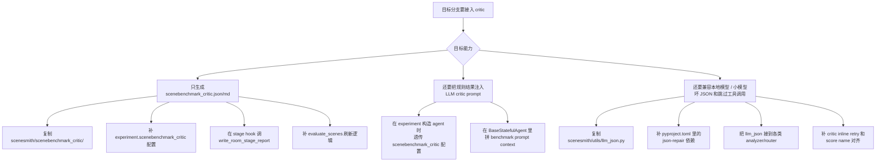
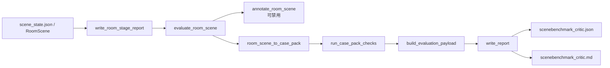

# SceneBenchmark Critic 接入总文档

这份文档面向“想把当前分支里的 critic 模块接到别的 SceneSmith 分支里”的开发者。目标不是解释所有实现细节，而是回答三件事：

1. 最少要拷哪些文件。
2. 哪些代码改动是运行必需，哪些只是增强项。
3. 接完以后怎么确认真的打通了。

## 一图看懂



## 1. 先讲结论

不要整段 merge 或 cherry-pick 整个 `critic` 分支。

推荐做法是：

1. 整包复制 [scenesmith/scenebenchmark_critic/](../scenesmith/scenebenchmark_critic/)
2. 只对已有文件合并和 critic 直接相关的 hunk
3. 最后用测试和输出目录验证

原因很简单：这个分支里还混了服务启动稳健性、材料检索开关、批跑脚本和测试补充，整段抄过去很容易把无关逻辑一起带进目标分支。

## 2. critic 模块的最小运行链路

当前 critic 的公共入口在：

- [scenesmith/scenebenchmark_critic/__init__.py](../scenesmith/scenebenchmark_critic/__init__.py)
- [scenesmith/scenebenchmark_critic/api.py](../scenesmith/scenebenchmark_critic/api.py)
- [scenesmith/scenebenchmark_critic/config.py](../scenesmith/scenebenchmark_critic/config.py)

最小链路是：



对应代码位置：

- `write_room_stage_report` / `write_house_stage_report` 在 [scenesmith/scenebenchmark_critic/api.py](../scenesmith/scenebenchmark_critic/api.py)
- `CriticConfig` 和 `critic_config_from_any` 在 [scenesmith/scenebenchmark_critic/config.py](../scenesmith/scenebenchmark_critic/config.py)

## 3. 最小接入方案：只生成和刷新 critic report

如果目标分支只想产出 `scenebenchmark_critic.json` 和 `scenebenchmark_critic.md`，按下面四步接就够了。

### 3.1 复制 critic 包本体

必须整包复制：

- [scenesmith/scenebenchmark_critic/](../scenesmith/scenebenchmark_critic/)

不要只挑 `api.py` 或 `config.py`。原因是这个包已经不是单文件工具，而是一整套运行链路，里面包含：

- adapter
- reports
- vendor rules
- asset annotation
- config

而且 `__init__.py` 已经导出多组 API，不适合拆着搬：

- [scenesmith/scenebenchmark_critic/__init__.py](../scenesmith/scenebenchmark_critic/__init__.py)

### 3.2 同时复制 `llm_json.py` 和依赖

虽然这看起来像“LLM 兜底”，但在当前包结构下它已经是 critic 的运行依赖。

必须带上：

- [scenesmith/utils/llm_json.py](../scenesmith/utils/llm_json.py)
- [pyproject.toml](../pyproject.toml)

原因是：

- `annotate_room_scene` 所在文件会依赖 `llm_json.py`
- `evaluate_room_scene` 默认会经过 `annotate_room_scene`
- 所以只要目标分支 import 了 [scenesmith/scenebenchmark_critic/api.py](../scenesmith/scenebenchmark_critic/api.py)，`llm_json.py` 最好就一起带上

如果目标分支暂时完全不想跑 annotation，可以在配置里把 `asset_annotation.enabled` 关掉，但文件和依赖本身仍建议一起复制，避免后续 import 或配置扩展再踩坑。

### 3.3 合并 experiment 配置

把下面配置块并到目标分支的：

- [configurations/experiment/base_experiment.yaml](../configurations/experiment/base_experiment.yaml)

当前默认配置在这个文件的 `scenebenchmark_critic:` 段，关键字段包括：

```yaml
scenebenchmark_critic:
  enabled: false
  metrics: ["spatial_accessibility", "functional_dependency"]
  room_stage_hooks: ["scene_after_furniture", "final_scene"]
  house_stage_hooks: []
  inject_into_llm_critic: true
  hard_gate: false
  max_issues_for_prompt: 8
  fail_gate_threshold: 1
  degraded_gate_threshold: 999999
  asset_annotation:
    enabled: false
```

最少要保留：

- `enabled`
- `metrics`
- `room_stage_hooks`
- `house_stage_hooks`
- `inject_into_llm_critic`
- `asset_annotation`

说明：

- `room_stage_hooks` 决定房间级 report 写到哪些阶段目录。
- `house_stage_hooks` 默认是空，单房间迁移一般不用开。
- `asset_annotation.enabled` 初次接入建议保持 `false`，先把 report 链路打通。

### 3.4 在场景生成阶段写 report

当前分支的房间级 report 固定落在两个 stage：

- `scene_after_furniture`
- `final_scene`

对应代码在：

- [scenesmith/experiments/indoor_scene_generation.py](../scenesmith/experiments/indoor_scene_generation.py)

最关键的是把这一类调用并过去：

```python
write_room_stage_report(
    scene,
    stage_dir,
    config=cfg_dict,
    stage="<stage_name>",
)
```

迁移时注意两点：

1. `stage` 名必须和 `room_stage_hooks` 对齐。
2. `config` 这里传完整的 experiment 配置，而不是只传 `CriticConfig`。

当前实现这么传，是因为 asset annotation 和 config 解析链路都允许从完整配置里继续取值，见：

- [scenesmith/scenebenchmark_critic/api.py](../scenesmith/scenebenchmark_critic/api.py)
- [scenesmith/scenebenchmark_critic/config.py](../scenesmith/scenebenchmark_critic/config.py)

### 3.5 给 `evaluate_scenes` 补刷新逻辑

如果目标分支已经有 `evaluate_scenes`，把 critic 刷新逻辑并进去；如果没有，就按当前实现加一份同等行为。

参考位置：

- [scenesmith/experiments/indoor_scene_generation.py](../scenesmith/experiments/indoor_scene_generation.py)

最关键的行为是：

1. 先解析 `critic_config = critic_config_from_any(self.cfg)`
2. `enabled=false` 时直接跳过
3. 扫描 `scene_*/room_*/scene_states/<stage>/scene_state.json`
4. 对每个命中的 stage 调 `write_room_stage_report(...)`
5. 如果启用了 `house_stage_hooks`，再额外刷新 house report

## 4. 进阶接入：把 SceneBenchmark 结果注入 LLM critic

这部分不是“产出 report”的必需项，但它是当前分支区别于普通 report-only 接法的重要能力。

### 4.1 在 agent 构造阶段透传 critic 配置

目标是让 agent 运行时也能读到 `scenebenchmark_critic`。

当前做法在：

- [scenesmith/experiments/base_experiment.py](../scenesmith/experiments/base_experiment.py)

核心形态是：

```python
agent_config["scenebenchmark_critic"] = config_dict["experiment"].get(
    "scenebenchmark_critic", {}
)
```

当前已经这样透传的 agent 包括：

- furniture
- manipuland
- wall
- ceiling

如果目标分支还有自定义 placement agent，也要按同样模式加进去。

### 4.2 在 `BaseStatefulAgent` 里拼 benchmark context

关键逻辑在：

- [scenesmith/agent_utils/base_stateful_agent.py](../scenesmith/agent_utils/base_stateful_agent.py)

这部分做了两件事：

1. 在 `request_critique()` 前，先跑一次轻量级 SceneBenchmark rule critic
2. 把 `format_prompt_context(...)` 结果拼进 critic 的 physics context

关键方法包括：

- `_build_scenebenchmark_critic_context`
- `_request_critique_impl`

当前限制也在这里：

- 默认只对 `furniture` 和 `manipuland` 注入
- `wall` 和 `ceiling` 不注入

如果目标分支想扩到别的 agent type，要一起改这段判断。

## 5. 增强接入：兼容本地模型 / 小模型

如果目标分支主要跑官方模型，这一节可以按需取舍。  
如果目标分支会跑本地模型、小模型、或者工具调用不稳定的 OpenAI-compatible 模型，这一节建议一起带上。

### 5.1 JSON 解析兜底

统一入口：

- [scenesmith/utils/llm_json.py](../scenesmith/utils/llm_json.py)

它主要处理：

- fenced JSON
- 顶层返回 JSON 字符串
- 轻微逗号、括号格式漂移

当前接入点包括：

- [scenesmith/agent_utils/asset_router/router.py](../scenesmith/agent_utils/asset_router/router.py)
- [scenesmith/agent_utils/scene_analyzer.py](../scenesmith/agent_utils/scene_analyzer.py)
- [scenesmith/agent_utils/mesh_physics_analyzer.py](../scenesmith/agent_utils/mesh_physics_analyzer.py)
- [scenesmith/agent_utils/articulated_physics_analyzer.py](../scenesmith/agent_utils/articulated_physics_analyzer.py)
- [scenesmith/scenebenchmark_critic/asset_annotation.py](../scenesmith/scenebenchmark_critic/asset_annotation.py)

### 5.2 critic 跳过工具调用时的 inline retry

关键逻辑在：

- [scenesmith/agent_utils/base_stateful_agent.py](../scenesmith/agent_utils/base_stateful_agent.py)

这部分解决的问题是：

- critic 没调用 `observe_scene`
- critic 没调用 `get_current_scene_state`
- critic 返回“没有上下文所以无法评价”的全 0 废话

当前实现会：

1. 检查这轮 tool call 是否包含必要只读工具
2. 检查返回是不是典型 fallback critique
3. 如果命中，就把最近 render 和紧凑 scene summary 直接拼回去重试一次

如果目标分支只要 report，不改 agent 回路，这部分可以不带。

### 5.3 score category 名对齐

关键逻辑在：

- [scenesmith/agent_utils/scoring.py](../scenesmith/agent_utils/scoring.py)

它解决的是 score 名漂移问题，比如：

- `Prompt Following`
- `prompt_following`

如果目标分支保留了 planner / critic 的 delta 比较、回滚和 reset 逻辑，这部分建议一起合并。

### 5.4 floor plan critic 的 render 兜底

关键逻辑在：

- [scenesmith/floor_plan_agents/stateful_floor_plan_agent.py](../scenesmith/floor_plan_agents/stateful_floor_plan_agent.py)

这个改动只解决一个问题：final critique 时如果模型没重新 `observe_scene`，不要因为没有 `render_dir` 直接崩掉。

如果目标分支没有 floor-plan critic，这部分可以不带。

## 6. 复制清单

### 6.1 必带

- [scenesmith/scenebenchmark_critic/](../scenesmith/scenebenchmark_critic/)
- [scenesmith/utils/llm_json.py](../scenesmith/utils/llm_json.py)
- [configurations/experiment/base_experiment.yaml](../configurations/experiment/base_experiment.yaml)
- [scenesmith/experiments/indoor_scene_generation.py](../scenesmith/experiments/indoor_scene_generation.py)
- [pyproject.toml](../pyproject.toml)

### 6.2 如果要把规则结果注入 LLM critic

再带上：

- [scenesmith/experiments/base_experiment.py](../scenesmith/experiments/base_experiment.py)
- [scenesmith/agent_utils/base_stateful_agent.py](../scenesmith/agent_utils/base_stateful_agent.py)

### 6.3 如果还要保留当前分支的兜底能力

再带上：

- [scenesmith/agent_utils/scoring.py](../scenesmith/agent_utils/scoring.py)
- [scenesmith/agent_utils/asset_router/router.py](../scenesmith/agent_utils/asset_router/router.py)
- [scenesmith/agent_utils/scene_analyzer.py](../scenesmith/agent_utils/scene_analyzer.py)
- [scenesmith/agent_utils/mesh_physics_analyzer.py](../scenesmith/agent_utils/mesh_physics_analyzer.py)
- [scenesmith/agent_utils/articulated_physics_analyzer.py](../scenesmith/agent_utils/articulated_physics_analyzer.py)
- [scenesmith/floor_plan_agents/stateful_floor_plan_agent.py](../scenesmith/floor_plan_agents/stateful_floor_plan_agent.py)

## 7. 不建议一起搬的内容

下面这些不是别人接 critic 的运行必需项：

- [scripts/run_single_room_critic_probe.sh](../scripts/run_single_room_critic_probe.sh)
- `tests/unit/test_*`
- Convex decomposition server 启动稳健性那组改动
- `materials_retrieval_server.enabled` 那组改动

这些功能可以后面再独立评估，不要和 critic 接入绑在一起迁移。

## 8. 同仓库分支之间的推荐迁移命令

如果目标分支和当前 `critic` 分支在同一个仓库里，推荐先切到目标分支，再做“目录复制 + hunk 合并”：

```bash
git switch <your-branch>
git restore --source critic -- scenesmith/scenebenchmark_critic
git restore --source critic -- scenesmith/utils/llm_json.py
```

然后只对这些现有文件做人工合并：

```bash
git diff HEAD..critic -- \
  pyproject.toml \
  configurations/experiment/base_experiment.yaml \
  scenesmith/experiments/indoor_scene_generation.py \
  scenesmith/experiments/base_experiment.py \
  scenesmith/agent_utils/base_stateful_agent.py \
  scenesmith/agent_utils/scoring.py \
  scenesmith/agent_utils/asset_router/router.py \
  scenesmith/agent_utils/scene_analyzer.py \
  scenesmith/agent_utils/mesh_physics_analyzer.py \
  scenesmith/agent_utils/articulated_physics_analyzer.py \
  scenesmith/floor_plan_agents/stateful_floor_plan_agent.py \
  main.py \
  configurations/config.yaml
```

不建议直接：

```bash
git cherry-pick <critic 分支上的一串提交>
```

因为这会把不想要的非 critic 改动一并带过去。

## 9. CLI 便利开关

如果目标分支也想支持这种顶层短参数：

```bash
python main.py ... scenebenchmark_critic_enabled=true
```

再额外合并：

- [main.py](../main.py)
- [configurations/config.yaml](../configurations/config.yaml)

这只是 CLI 便利性，不是运行必需项。

## 10. 最容易冲突的地方

手工合并时，优先检查这几类问题：

1. 目标分支如果改过 stage 名，`room_stage_hooks` 要一起改。
2. 目标分支如果改过 agent 构造流程，要确认 `scenebenchmark_critic` 真的传到了 agent cfg。
3. 目标分支如果有自定义 agent type，要确认 `_build_scenebenchmark_critic_context` 的注入条件是否覆盖。
4. 目标分支如果不跑 combined-house 场景，不要误开 `house_stage_hooks`。
5. 目标分支如果暂时不想引入外部视觉调用，保持 `asset_annotation.enabled=false`。

## 11. 建议一起带的测试

如果想保证行为和当前分支尽量一致，建议至少一起迁移这些测试：

- [tests/unit/test_main.py](../tests/unit/test_main.py)
- [tests/unit/test_scoring.py](../tests/unit/test_scoring.py)
- [tests/unit/test_scenebenchmark_critic.py](../tests/unit/test_scenebenchmark_critic.py)

如果目标分支还要带 floor plan critic render fallback，再加：

- [tests/unit/test_floor_plan_critic_fallback.py](../tests/unit/test_floor_plan_critic_fallback.py)

## 12. 接入完成后的验收标准

### 12.1 最小接入验收

满足下面三条，说明 report-only 链路已经打通：

1. `generate_scenes` 结束后，`scene_states/scene_after_furniture/` 或 `scene_states/final_scene/` 目录下能看到 `scenebenchmark_critic.json` 和 `scenebenchmark_critic.md`
2. 单独跑 `evaluate_scenes` 时会刷新这些 report
3. 把 `experiment.scenebenchmark_critic.enabled=false` 后，不会再写 report

### 12.2 LLM critic 注入验收

满足下面两条，说明 prompt 注入链路已经打通：

1. `furniture` 或 `manipuland` critic prompt 中能拿到额外的 SceneBenchmark issue context
2. `inject_into_llm_critic=false` 后，这段 context 会消失

### 12.3 小模型 / 本地模型兜底验收

满足下面三条，说明兜底能力基本在：

1. fenced JSON 或轻微坏 JSON 不会直接导致解析失败
2. critic 首轮没调观察工具时，会自动重试，而不是直接输出零分拒答
3. score category 名大小写或下划线漂移时，不会误判 delta 或 reset

## 13. 推荐的接入顺序

如果是第一次接，建议按这个顺序推进：

1. 先打通 report-only
2. 再决定要不要接入 LLM critic prompt
3. 最后再补本地模型 / 小模型兜底

这样做的好处是每一层都有清晰的验收标准，出问题时也更容易定位是：

- critic 包本身没接好
- stage hook 没落对
- agent prompt 注入没透传
- 还是模型输出兼容层出了问题
